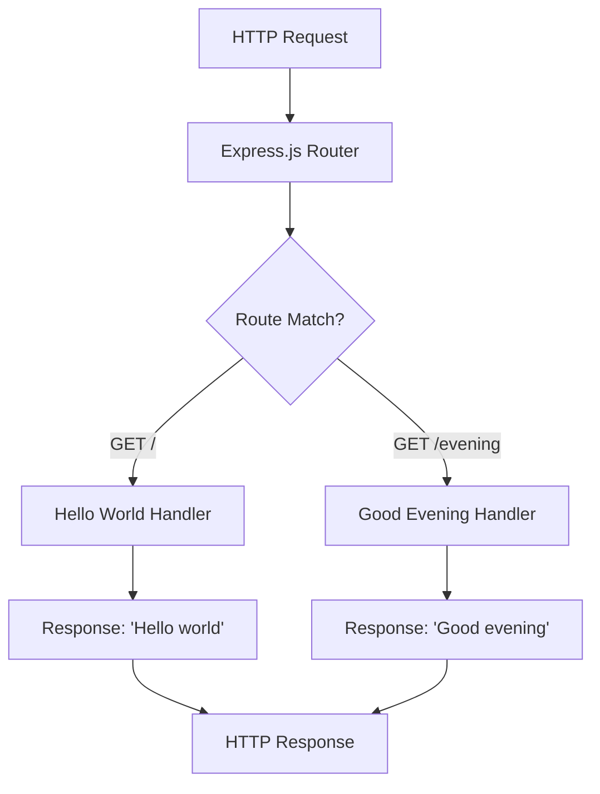

# Technical Specification

# 0. Agent Action Plan

## 0.1 Intent Clarification

Based on the provided requirements, the Blitzy platform understands that the objective is to **add Express.js to an existing Node.js project and create a new HTTP endpoint that returns "Good evening"**.

### 0.1.1 Core Objective

The user has described a tutorial-style Node.js server project with the following characteristics and goals:

- **Current State**: A basic Node.js server hosting one endpoint that returns "Hello world"
- **Desired Enhancement**: Integrate Express.js framework into the project
- **New Feature**: Add a second endpoint that returns "Good evening"

**Requirements Restated with Enhanced Clarity:**

| # | Original Requirement | Technical Interpretation |
|---|---------------------|-------------------------|
| 1 | "tutorial of node js server hosting one endpoint that returns 'Hello world'" | Create a basic Node.js HTTP server with a root endpoint (`/`) returning plain text "Hello world" |
| 2 | "add expressjs into the project" | Install Express.js framework as a project dependency and refactor the server to use Express.js routing and middleware patterns |
| 3 | "add another endpoint that return the response of 'Good evening'" | Create a new GET endpoint (e.g., `/evening`) that returns the plain text response "Good evening" |

**Implicit Requirements Detected:**

- Initialize a proper Node.js project structure with `package.json`
- Ensure both endpoints follow RESTful conventions (GET requests)
- Maintain the existing "Hello world" endpoint functionality after Express.js integration
- Set up appropriate HTTP port configuration (default: 3000)
- Include proper server startup and shutdown handling

### 0.1.2 Task Categorization

| Category | Classification |
|----------|---------------|
| **Primary Task Type** | Feature Addition |
| **Secondary Aspects** | Framework Integration, API Development |
| **Scope Classification** | Infrastructure Change (Greenfield Node.js Project) |
| **Complexity Level** | Low - Simple HTTP endpoint implementation |

### 0.1.3 Special Instructions and Constraints

**User-Specified Directives:**
- Integrate Express.js as the web framework
- Preserve the "Hello world" response functionality
- Add a new endpoint returning "Good evening"

**Methodological Requirements:**
- Follow Express.js best practices for routing
- Use standard Node.js project conventions
- Ensure clean, tutorial-friendly code structure

**User Example (Preserved Exactly):**
- Response text for existing endpoint: `"Hello world"`
- Response text for new endpoint: `"Good evening"`

### 0.1.4 Technical Interpretation

These requirements translate to the following technical implementation strategy:

- **To establish the project foundation**, we will **create** a `package.json` file to define project metadata and dependencies
- **To integrate Express.js**, we will **install** `express` package via npm and **create** a server entry point that utilizes Express.js application patterns
- **To implement the "Hello world" endpoint**, we will **create** a GET route handler at the root path (`/`) returning the specified response
- **To implement the "Good evening" endpoint**, we will **create** a GET route handler at `/evening` path returning the specified response
- **To ensure proper project structure**, we will **create** appropriate documentation and configuration files

```javascript
// Target implementation pattern
app.get('/', (req, res) => res.send('Hello world'));
app.get('/evening', (req, res) => res.send('Good evening'));
```


## 0.2 Repository Scope Discovery

### 0.2.1 Comprehensive File Analysis

**Current Repository State:**

The repository analysis reveals a minimal/greenfield project structure with only a single file present:

| File Path | Type | Content | Status |
|-----------|------|---------|--------|
| `README.md` | Documentation | Single heading: "# 12-dec7" | Exists - Requires Update |

**Files to Create (Based on Task Type - Feature Addition with Express.js):**

| Pattern | Purpose | Files to Generate |
|---------|---------|-------------------|
| `package.json` | Node.js project configuration | Project metadata, dependencies, scripts |
| `src/**/*.js` | Source code | Main server application file |
| `README.md` | Documentation | Project setup and usage instructions |
| `.gitignore` | Version control | Exclude node_modules and environment files |

**Related File Discovery:**

Since this is a greenfield project, no existing files need modification for dependency injection. The following files will be created from scratch:

- **Entry Point**: Main Express.js server file
- **Configuration**: Package manifest with Express.js dependency
- **Documentation**: README with usage instructions
- **Version Control**: Git ignore patterns for Node.js projects

### 0.2.2 Web Search Research Conducted

Research was conducted to validate implementation approaches:

| Research Topic | Key Findings |
|----------------|--------------|
| Express.js Latest Version | Express.js 5.2.1 is the latest stable version (released December 2024) |
| Node.js Compatibility | Express 5.x requires Node.js 18 or higher |
| Environment Status | Node.js v20.19.6 available, fully compatible with Express 5.x |
| Best Practices | Use `app.get()` for route handlers, `res.send()` for plain text responses |

### 0.2.3 Existing Infrastructure Assessment

| Assessment Area | Current State | Action Required |
|-----------------|---------------|-----------------|
| **Project Structure** | Minimal - README.md only | Create full Node.js project structure |
| **Existing Patterns** | None established | Define new patterns using Express.js conventions |
| **Build Configuration** | None | Create package.json with npm scripts |
| **Testing Infrastructure** | None | Not in scope per user requirements |
| **Documentation System** | Minimal README | Update README with project documentation |
| **Dependency Management** | No package.json | Initialize npm project with Express.js |

**Environment Verification:**

```
Node.js Version: v20.19.6 ✓
NPM Version: 11.1.0 ✓
Express.js Compatibility: Requires Node.js 18+ ✓ (v20 exceeds requirement)
```

### 0.2.4 Directory Structure Analysis

**Current Structure:**
```
/
├── README.md           # Minimal documentation (heading only)
└── .git/               # Git repository initialized
```

**Target Structure (After Implementation):**
```
/
├── package.json        # [CREATE] Project configuration and dependencies
├── src/
│   └── index.js        # [CREATE] Express.js server with endpoints
├── README.md           # [UPDATE] Full project documentation
└── .gitignore          # [CREATE] Node.js ignore patterns
```


## 0.3 File Transformation Mapping

### 0.3.1 File-by-File Execution Plan

| Target File | Transformation | Source File/Reference | Purpose/Changes |
|-------------|----------------|----------------------|-----------------|
| `package.json` | CREATE | Express.js conventions | Initialize Node.js project with Express.js dependency, define start script |
| `src/index.js` | CREATE | Express.js tutorial patterns | Create Express.js server with two GET endpoints: "/" returns "Hello world", "/evening" returns "Good evening" |
| `README.md` | UPDATE | `README.md` | Transform minimal heading into comprehensive project documentation with setup and usage instructions |
| `.gitignore` | CREATE | Node.js .gitignore template | Add standard Node.js ignore patterns (node_modules, .env, logs) |

### 0.3.2 New Files Detail

**`package.json` - Node.js Project Configuration**
- Content type: Configuration
- Based on: Standard npm project initialization
- Key sections:
  - `name`: Project identifier
  - `version`: Semantic version (1.0.0)
  - `main`: Entry point (`src/index.js`)
  - `scripts.start`: Node.js start command
  - `dependencies.express`: Express.js framework

**`src/index.js` - Express.js Server Application**
- Content type: Source code
- Based on: Express.js application patterns
- Key functions:
  - Express app initialization
  - Root route handler (`/`) returning "Hello world"
  - Evening route handler (`/evening`) returning "Good evening"
  - Server listener on configurable port

**.gitignore - Version Control Exclusions**
- Content type: Configuration
- Based on: Node.js .gitignore template
- Key patterns:
  - `node_modules/` - Dependency directory
  - `.env` - Environment variables
  - `*.log` - Log files

### 0.3.3 Files to Modify Detail

**`README.md` - Project Documentation**
- Current content: Single heading "# 12-dec7"
- Sections to update:
  - Title and project description
  - Prerequisites section
  - Installation instructions
  - Usage guide with endpoint documentation
  - API reference for both endpoints
- Content to add:
  - Project overview
  - Quick start guide
  - Available endpoints table
  - Example curl commands
- Content to remove:
  - Placeholder heading (replace with meaningful content)

### 0.3.4 Configuration and Documentation Updates

**Configuration Changes:**

| Config File | Settings to Configure | Impact |
|-------------|----------------------|--------|
| `package.json` | `type: "commonjs"` or ES modules config | Determines JavaScript module system |
| `package.json` | `scripts.start: "node src/index.js"` | Enables `npm start` command |
| `package.json` | `dependencies.express: "^5.2.1"` | Installs Express.js framework |

**Documentation Updates:**

| Doc File | Sections to Add/Update | Cross-references |
|----------|----------------------|------------------|
| `README.md` | Project title and description | Link to Express.js documentation |
| `README.md` | Installation steps | Reference to package.json |
| `README.md` | API endpoints | Reference to src/index.js routes |
| `README.md` | Usage examples | Curl command examples |

### 0.3.5 Cross-File Dependencies

**Import/Reference Updates Required:**
- `src/index.js` requires `express` package from `node_modules`
- `package.json` must declare `express` as dependency before `src/index.js` can import it
- `README.md` references entry point defined in `package.json`

**Configuration Sync Requirements:**
- Port number in `src/index.js` should align with documentation in `README.md`
- Start script in `package.json` must point to correct entry file path

**Documentation Consistency Needs:**
- Endpoint paths documented in `README.md` must match routes in `src/index.js`
- Response text documented must match actual implementation


## 0.4 Dependency Inventory

### 0.4.1 Key Private and Public Packages

| Registry | Package Name | Version | Purpose |
|----------|--------------|---------|---------|
| npm | express | ^5.2.1 | Fast, unopinionated, minimalist web framework for Node.js - handles HTTP routing and middleware |

**Version Justification:**
- Express.js 5.2.1 is the latest stable release (published December 2024)
- Requires Node.js 18+, which is satisfied by our environment (Node.js v20.19.6)
- Contains security fixes including mitigation for CVE-2024-45590 (ReDoS attacks)

### 0.4.2 Runtime Requirements

| Runtime | Required Version | Environment Version | Status |
|---------|-----------------|---------------------|--------|
| Node.js | ≥18.0.0 | v20.19.6 | ✓ Compatible |
| npm | ≥7.0.0 | v11.1.0 | ✓ Compatible |

### 0.4.3 Dependency Updates

**New Dependencies to Add:**

| Package | Version | Reason for Addition |
|---------|---------|---------------------|
| express | ^5.2.1 | Required framework for implementing HTTP endpoints per user requirements |

**Dependencies to Update:** N/A (Greenfield project)

**Dependencies to Remove:** N/A (Greenfield project)

### 0.4.4 Import/Reference Updates

**Files Requiring Import Updates:**

| File Pattern | Import Statement | Purpose |
|--------------|------------------|---------|
| `src/index.js` | `const express = require('express');` | Import Express.js framework |

**Import Transformation Rules:**

```javascript
// src/index.js - Required import
const express = require('express');
const app = express();
```

### 0.4.5 Express.js Transitive Dependencies

Express.js 5.x includes the following bundled dependencies (managed automatically via npm):

| Package | Purpose |
|---------|---------|
| body-parser | Request body parsing middleware |
| content-type | MIME type handling |
| cookie | Cookie parsing utilities |
| debug | Debugging utility |
| finalhandler | Final response handler |
| qs | Query string parsing |
| router | HTTP request routing |

**Note:** These transitive dependencies are automatically installed when Express.js is installed. No manual configuration is required.

### 0.4.6 Package.json Configuration

The following `package.json` structure will be created:

```json
{
  "name": "nodejs-express-tutorial",
  "version": "1.0.0",
  "description": "Node.js Express server tutorial",
  "main": "src/index.js",
  "scripts": {
    "start": "node src/index.js"
  },
  "dependencies": {
    "express": "^5.2.1"
  }
}
```


## 0.5 Implementation Design

### 0.5.1 Technical Approach

**Primary Objectives with Implementation Approach:**

| Goal | Implementation Approach | Rationale |
|------|------------------------|-----------|
| Establish project foundation | Create `package.json` with npm init patterns | Required for Node.js dependency management |
| Integrate Express.js framework | Install express package via npm, configure in entry file | User explicitly requested Express.js integration |
| Implement "Hello world" endpoint | Create GET route at `/` path using `app.get()` | Maintains original functionality per user requirements |
| Implement "Good evening" endpoint | Create GET route at `/evening` path using `app.get()` | New feature requested by user |

**Logical Implementation Flow:**

- **First**, establish the Node.js project foundation by creating `package.json` with project metadata and Express.js dependency declaration
- **Next**, create the Express.js server application in `src/index.js` with proper initialization and route handlers
- **Then**, configure both endpoint routes with appropriate response handlers
- **Finally**, ensure quality by updating documentation with complete usage instructions and API reference

### 0.5.2 Component Impact Analysis

**Direct Modifications Required:**

| Component | Modification | Capability Enabled |
|-----------|-------------|-------------------|
| `package.json` | Create new file | Node.js project initialization, dependency management, npm scripts |
| `src/index.js` | Create new file | Express.js server with HTTP endpoint handling |
| `README.md` | Update existing file | Developer documentation for setup and usage |
| `.gitignore` | Create new file | Clean version control excluding dependencies |

**Indirect Impacts and Dependencies:**

| Component | Impact | Reason |
|-----------|--------|--------|
| `node_modules/` | Will be created | Generated by `npm install` - contains Express.js and dependencies |
| `package-lock.json` | Will be created | Generated by npm for deterministic dependency resolution |

**New Components Introduction:**

| Component | Type | Responsibility | Rationale |
|-----------|------|----------------|-----------|
| `src/index.js` | Express.js Application | HTTP server entry point, route handling | Central component for API functionality |
| `src/` directory | Folder | Source code organization | Industry-standard project structure |

### 0.5.3 User-Provided Examples Integration

**User Example: Response Texts**

The user explicitly specified response text values:

| Endpoint | User-Specified Response | Implementation |
|----------|------------------------|----------------|
| Existing endpoint | `"Hello world"` | `res.send('Hello world')` at `/` route |
| New endpoint | `"Good evening"` | `res.send('Good evening')` at `/evening` route |

**Implementation Fidelity:**

```javascript
// Exact implementation matching user requirements
app.get('/', (req, res) => {
  res.send('Hello world');  // User Example: "Hello world"
});

app.get('/evening', (req, res) => {
  res.send('Good evening');  // User Example: "Good evening"
});
```

### 0.5.4 Critical Implementation Details

**Design Patterns Employed:**

| Pattern | Application | Benefit |
|---------|-------------|---------|
| Route Handler Pattern | Express.js `app.get()` callbacks | Clean separation of endpoint logic |
| Module Pattern | CommonJS `require()` | Standard Node.js module resolution |
| Middleware Pipeline | Express.js request handling | Extensible request processing |

**Key Algorithms/Approaches:**

- **HTTP GET Handling**: Express.js route registration with callback-based response generation
- **Server Initialization**: Express application factory pattern with `express()` call
- **Port Configuration**: Environment variable fallback pattern (`process.env.PORT || 3000`)

**Integration Strategy:**



**Data Flow:**

- Incoming HTTP GET request → Express.js router → Route handler → Plain text response

**Error Handling Considerations:**

- Express.js provides default 404 handling for unmatched routes
- Server startup errors logged to console
- No custom error handling required for this tutorial scope

**Performance Considerations:**

- Express.js is optimized for high-throughput HTTP handling
- Plain text responses minimize response payload
- No database or external service calls - minimal latency

**Security Considerations:**

- Express.js 5.x includes security patches for ReDoS vulnerabilities
- No user input processing required for static response endpoints
- Default Express.js security headers applied


## 0.6 Scope Boundaries

### 0.6.1 Exhaustively In Scope

**Source Code Changes:**

| Pattern | Files | Purpose |
|---------|-------|---------|
| `src/**/*.js` | `src/index.js` | Express.js server application entry point |

**Configuration Updates:**

| Pattern | Files | Purpose |
|---------|-------|---------|
| `package.json` | `package.json` | Project manifest with dependencies and scripts |
| `.gitignore` | `.gitignore` | Version control exclusion patterns |

**Documentation Updates:**

| Pattern | Files | Purpose |
|---------|-------|---------|
| `README.md` | `README.md` | Project documentation, setup, and API reference |

**Complete File Inventory (In Scope):**

| File | Action | Description |
|------|--------|-------------|
| `package.json` | CREATE | Node.js project configuration |
| `src/index.js` | CREATE | Express.js server with endpoints |
| `README.md` | UPDATE | Project documentation |
| `.gitignore` | CREATE | Git ignore patterns |

### 0.6.2 Explicitly Out of Scope

**Related Features NOT Specified by User:**

| Feature | Reason for Exclusion |
|---------|---------------------|
| POST/PUT/DELETE endpoints | User only requested GET endpoints |
| Database integration | Not mentioned in requirements |
| Authentication/Authorization | Not part of tutorial scope |
| Frontend/HTML responses | User specified plain text responses |
| WebSocket support | Not requested |

**Performance Optimizations Beyond Requirements:**

| Optimization | Reason for Exclusion |
|--------------|---------------------|
| Clustering/Load balancing | Tutorial-level project |
| Response caching | Simple static responses |
| Compression middleware | Not required for plain text |
| Rate limiting | Not specified |

**Refactoring Unrelated to Core Objectives:**

| Item | Reason for Exclusion |
|------|---------------------|
| TypeScript migration | User specified JavaScript tutorial |
| ESM (ES Modules) conversion | CommonJS is standard for tutorials |
| Code linting configuration | Not requested |

**Additional Tooling NOT Mentioned:**

| Tool | Reason for Exclusion |
|------|---------------------|
| Testing frameworks (Jest, Mocha) | Not in user requirements |
| Docker containerization | Not requested |
| CI/CD pipelines | Not specified |
| Environment management (dotenv) | Simple tutorial scope |

**Future Enhancements NOT Part of Current Request:**

| Enhancement | Status |
|-------------|--------|
| Additional endpoints | Only `/` and `/evening` requested |
| Request body parsing | Not required for GET endpoints |
| Response formatting (JSON) | User specified plain text |
| Logging middleware | Not specified |

**Explicitly Excluded by Context:**

| Item | Reason |
|------|--------|
| Existing codebase modification | Greenfield project - no existing code |
| Migration from other frameworks | Fresh Express.js implementation |
| Backwards compatibility concerns | New project - no legacy support needed |

### 0.6.3 Scope Validation Checklist

| Requirement | In Scope | Addressed By |
|-------------|----------|--------------|
| Node.js server | ✓ | `src/index.js` |
| Express.js integration | ✓ | `package.json`, `src/index.js` |
| "Hello world" endpoint | ✓ | `app.get('/')` route handler |
| "Good evening" endpoint | ✓ | `app.get('/evening')` route handler |
| Project setup | ✓ | `package.json`, `.gitignore` |
| Documentation | ✓ | `README.md` |


## 0.7 Execution Parameters

### 0.7.1 Special Execution Instructions

**Process-Specific Requirements:**

| Requirement | Specification |
|-------------|---------------|
| Framework | Express.js must be used (user explicitly requested) |
| Language | JavaScript (Node.js runtime) |
| Module System | CommonJS (`require`/`module.exports`) |
| Entry Point | `src/index.js` as main application file |
| Package Manager | npm (available in environment) |

**Tools and Platforms:**

| Tool | Version | Usage |
|------|---------|-------|
| Node.js | v20.19.6 | JavaScript runtime environment |
| npm | v11.1.0 | Package management and script execution |
| Express.js | ^5.2.1 | Web application framework |

**Quality and Style Requirements:**

| Aspect | Guideline |
|--------|-----------|
| Code Style | Tutorial-friendly, readable JavaScript |
| Comments | Inline documentation for clarity |
| Structure | Standard Node.js project organization |
| Response Format | Plain text (no JSON wrapping) |

### 0.7.2 Constraints and Boundaries

**Technical Constraints:**

| Constraint | Description |
|------------|-------------|
| Runtime | Node.js v20.x environment (pre-installed) |
| Dependencies | Express.js as the only required package |
| Port | Configurable (default: 3000) |
| Protocol | HTTP (HTTPS not in scope) |

**Process Constraints:**

| Should Do | Should NOT Do |
|-----------|---------------|
| Use Express.js routing | Use native Node.js `http` module directly |
| Create modular file structure | Place all code in single file root |
| Follow Express.js conventions | Deviate from framework patterns |
| Document all endpoints | Leave undocumented APIs |

**Output Constraints:**

| Output | Format |
|--------|--------|
| `/` endpoint response | Plain text: `Hello world` |
| `/evening` endpoint response | Plain text: `Good evening` |
| Response content-type | `text/html; charset=utf-8` (Express default for `res.send()`) |

**Compatibility Requirements:**

| Requirement | Specification |
|-------------|---------------|
| Node.js Compatibility | Node.js 18+ (Express 5.x requirement) |
| npm Compatibility | npm 7+ for lockfile v3 support |
| Operating System | Cross-platform (Linux, macOS, Windows) |

### 0.7.3 Execution Commands

**Project Setup Commands:**

```bash
# Initialize project directory structure
mkdir -p src

#### Install dependencies (after package.json creation)
npm install
```

**Runtime Commands:**

```bash
# Start the server
npm start

#### Or directly
node src/index.js
```

**Verification Commands:**

```bash
# Test Hello World endpoint
curl http://localhost:3000/

#### Test Good Evening endpoint
curl http://localhost:3000/evening
```

### 0.7.4 Environment Variables

| Variable | Default | Purpose |
|----------|---------|---------|
| `PORT` | 3000 | HTTP server listening port |

**Usage in Application:**

```javascript
const PORT = process.env.PORT || 3000;
app.listen(PORT, () => {
  console.log(`Server running on port ${PORT}`);
});
```


## 0.8 Special Instructions

### 0.8.1 Task-Specific Requirements

**User-Emphasized Directives:**

| Directive | Implementation Guidance |
|-----------|------------------------|
| "add expressjs into the project" | Install Express.js as project dependency, use Express.js application patterns for server implementation |
| "add another endpoint that return the response of 'Good evening'" | Create new GET route handler at `/evening` path with exact response text |

### 0.8.2 Pattern Compliance

**Express.js Best Practices to Follow:**

| Practice | Application |
|----------|-------------|
| Route Definition | Use `app.get(path, handler)` pattern |
| Response Method | Use `res.send()` for plain text responses |
| Port Configuration | Use environment variable with fallback default |
| Application Factory | Use `express()` to create app instance |

**Code Example Demonstrating Compliance:**

```javascript
const express = require('express');
const app = express();
const PORT = process.env.PORT || 3000;

app.get('/', (req, res) => res.send('Hello world'));
app.get('/evening', (req, res) => res.send('Good evening'));

app.listen(PORT, () => console.log(`Running on ${PORT}`));
```

### 0.8.3 Response Text Preservation

**Critical: Exact Response Text Matching**

The user specified exact response text that must be preserved:

| Endpoint | Exact Response Text | Notes |
|----------|---------------------|-------|
| `/` | `Hello world` | Lowercase 'w' in 'world' per user specification |
| `/evening` | `Good evening` | Capital 'G', lowercase 'e' per user specification |

**Do NOT modify:**
- Capitalization of response text
- Spacing in response text
- Add any additional formatting or punctuation

### 0.8.4 Project Structure Requirements

**Mandatory File Organization:**

```
project-root/
├── package.json          # Must exist for npm dependency management
├── src/
│   └── index.js          # Main application entry point
├── README.md             # Updated project documentation
└── .gitignore            # Node.js ignore patterns
```

### 0.8.5 Quality Assurance Checklist

| Checkpoint | Verification |
|------------|--------------|
| Express.js installed | `npm list express` shows version ^5.2.1 |
| Server starts without error | `npm start` runs successfully |
| Root endpoint works | `curl localhost:3000/` returns "Hello world" |
| Evening endpoint works | `curl localhost:3000/evening` returns "Good evening" |
| Documentation complete | README.md contains setup and usage instructions |

### 0.8.6 Implementation Order

**Recommended Sequence:**

1. Create project directory structure (`src/` folder)
2. Create `package.json` with Express.js dependency
3. Run `npm install` to fetch dependencies
4. Create `src/index.js` with Express.js server code
5. Create `.gitignore` for Node.js project
6. Update `README.md` with comprehensive documentation
7. Verify all endpoints respond correctly


